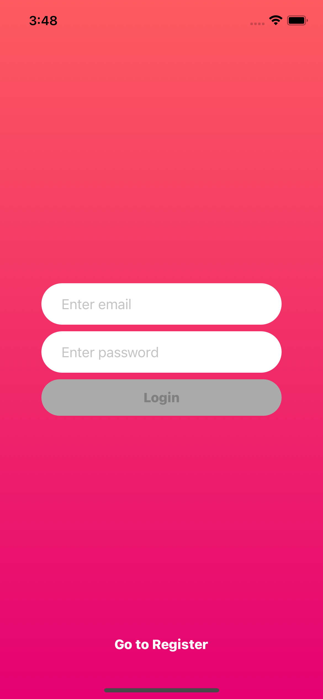
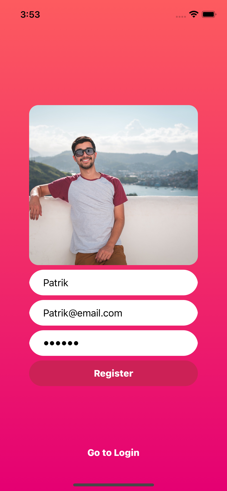
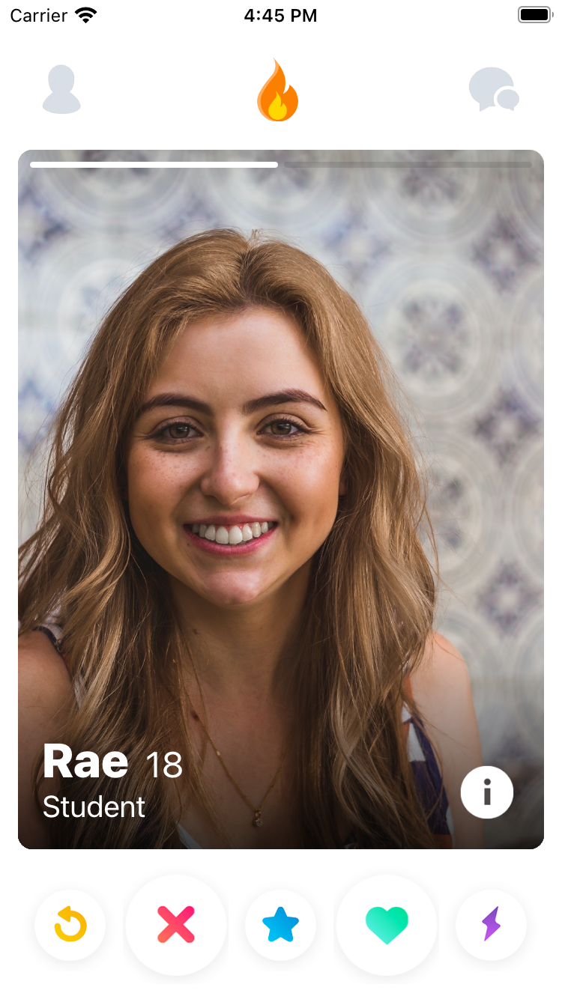
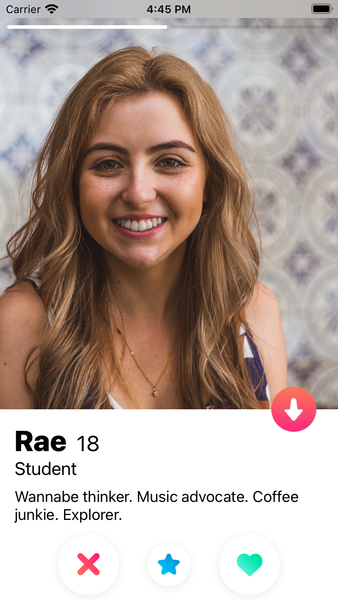
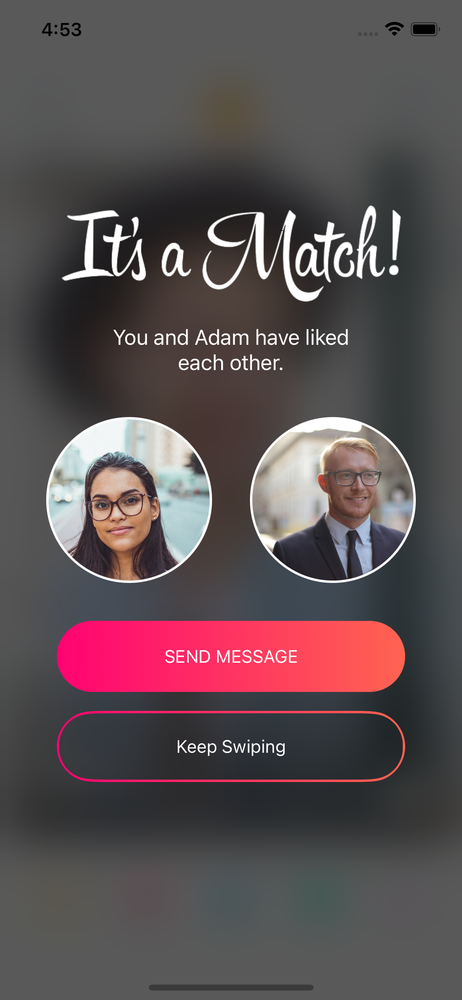
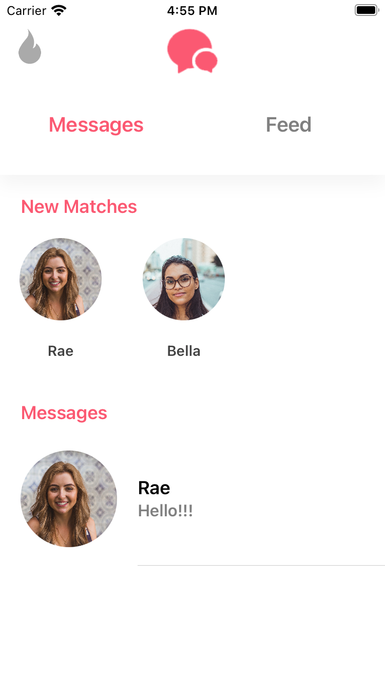
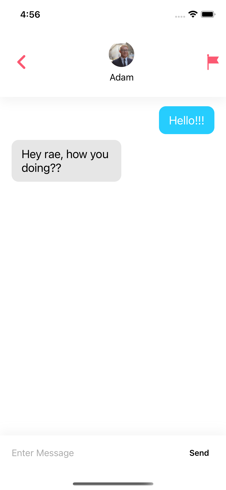

 
  

<h1 align="center"> Tinder MVP Clone</h1>

<!-- ABOUT THE PROJECT -->
<h2 id="about-the-project"> :pencil: About The Project</h2>

 
    This project is a MVP (minimum viable product) for a dating app, using MVC/MVVM architecture, View Code for UI, using similar Tinder's layout and Firebase as backend, you can:

- [x] Register
- [x] Login
- [x] Configure you user (name, age, bio, pictures)
- [x] Swipe through other users
- [x] Chat

<!-- REQUIREMENTS -->
<h2 id="overview"> 💻 Requirements</h2>

- [x] iOS 13.0
- [x] Change the Bundle Identifier
- [x] Configure Google Firebase and replace `GoogleService-Info.plist`.

<!-- App screenshots -->
<h2 id="overview"> :camera: App Screenshoots</h2>

 

  
 
 
 
  
 

 
 
 
 
  
  ˆ
 

